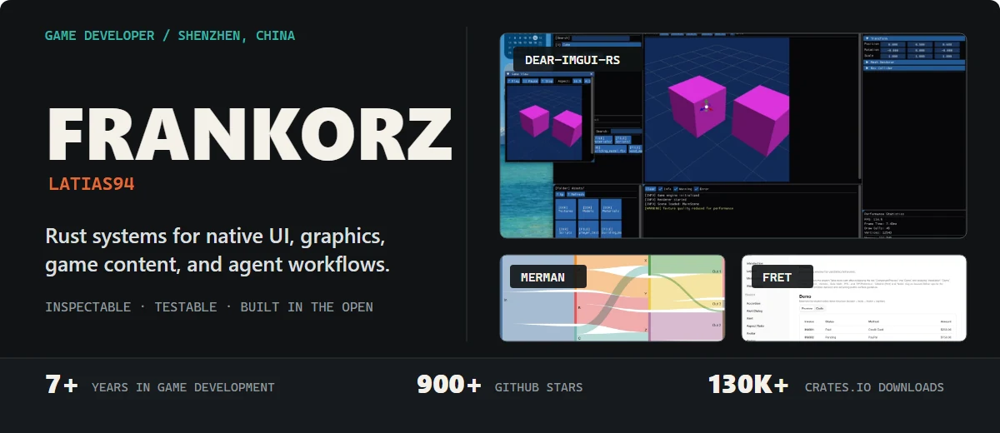
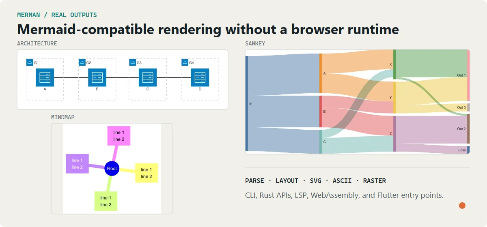
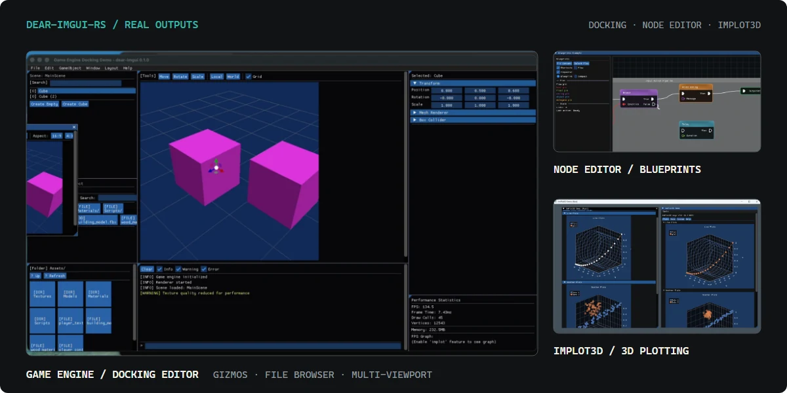
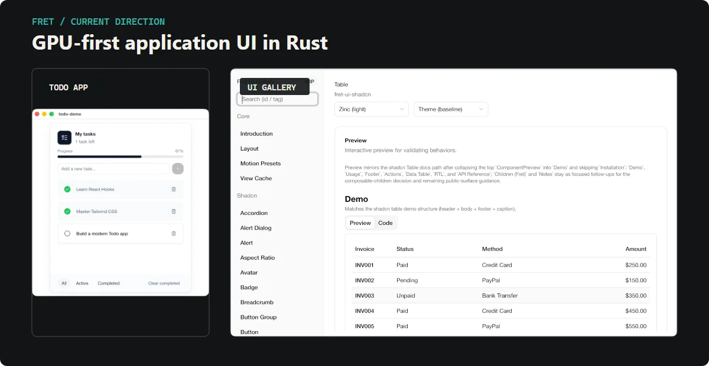

  

  <a href="https://frankorz.com/">Website</a> ·
  <a href="https://notes.frankorz.com/">Notes</a> ·
  <a href="https://github.com/Latias94?tab=repositories">Repositories</a> ·
  Shenzhen, China

I am a game developer with 7+ years of professional experience. Most of my open-source work is written in Rust and sits at the intersection of native UI, graphics and game infrastructure, and AI-assisted engineering.

I prefer tools that expose their state, keep boundaries explicit, and remain useful before they become polished products.

## Start with merman

  

**[merman](https://github.com/Latias94/merman)** is a parity-focused, browser-independent implementation of Mermaid in Rust. It covers parsing, layout, SVG and raster rendering, terminal output, diagnostics, editor tooling, and web integrations.

[Playground](https://frankorz.com/merman/) · [Repository](https://github.com/Latias94/merman) · [Crates.io](https://crates.io/crates/merman) · [Documentation](https://docs.rs/merman)

## Featured projects

### [dear-imgui-rs](https://github.com/Latias94/dear-imgui-rs)

  

A Rust bindings ecosystem for Dear ImGui with docking, WGPU, OpenGL, and Vulkan backends, plus editor-oriented extensions including ImPlot, ImGuizmo, ImNodes, node editors, file browsers, and reflection-based UI.

[Repository](https://github.com/Latias94/dear-imgui-rs) · [Crates.io](https://crates.io/crates/dear-imgui-rs) · [Documentation](https://docs.rs/dear-imgui-rs)

### [codex-helper](https://github.com/Latias94/codex-helper)

A local Codex CLI helper and proxy for provider routing, usage visibility, fallbacks, request inspection, and session recovery. Its terminal interface keeps routing decisions and token usage observable instead of hiding them behind configuration.

[Repository](https://github.com/Latias94/codex-helper) · [Install and usage](https://github.com/Latias94/codex-helper#readme)

## Currently building

  

**[Fret](https://github.com/Latias94/fret)** is an experimental, GPU-first Rust application UI framework for desktop applications, editor-grade interfaces, and WebGPU/wasm demos. It is the long-term exploration where rendering, layout, interaction, accessibility, and application structure meet.

## More projects

### Application infrastructure

- **[mdstream](https://github.com/Latias94/mdstream)** — streaming-first Markdown middleware for incremental LLM output in Rust UIs.
- **[open-gpui](https://github.com/Latias94/open-gpui)** — an independent fork continuing GPUI's evolution as a standalone Rust UI framework and ecosystem. That direction is already visible in a first-party component library, retained docking with multi-viewport windows, form and async resource state, deterministic motion, devtools, and canvas primitives.

### Game and graphics

- **[boxdd](https://github.com/Latias94/boxdd)** — safe Box2D v3 bindings with Bevy integration and browser examples.
- **[boxddd](https://github.com/Latias94/boxddd)** — experimental, engine-agnostic Rust bindings for Box3D and the 3D sibling of `boxdd`.
- **[asset-importer](https://github.com/Latias94/asset-importer)** — high-level Assimp bindings for practical 3D asset import and export.
- **[unity-asset](https://github.com/Latias94/unity-asset)** — parsers and extraction tools for Unity YAML and binary asset formats.
- **[spine2d](https://github.com/Latias94/spine2d)** — an experimental pure-Rust Spine 4.3 runtime for native, web, and Bevy.
- **[renderdog](https://github.com/Latias94/renderdog)** — RenderDoc capture, automation, and MCP tooling for graphics debugging.

### Agent and developer tools

- **[dev-skills](https://github.com/Latias94/dev-skills)** — reusable Codex skills and engineering workflows for large codebases.
- **[jsonrepair](https://github.com/Latias94/jsonrepair)** — a low-dependency Rust library and CLI for repairing malformed JSON.
- **[siumai](https://github.com/YumchaLabs/siumai)** — a type-safe, unified Rust API for multiple LLM providers.

## How I work

AI is part of my development workflow for exploration, tests, documentation, and repetitive implementation. Architecture, priorities, tradeoffs, maintainability, and product taste still require human judgment.

My game-development background shapes the problems I choose: editor workflows, rendering, runtime behavior, content pipelines, debugging, and the tools that connect them.

  <a href="https://frankorz.com/">frankorz.com</a> ·
  <a href="https://notes.frankorz.com/">public notes</a>

